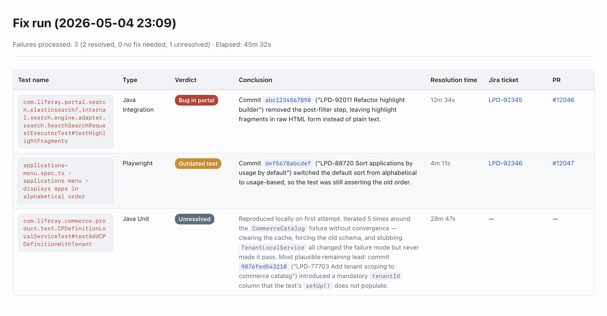

# Liferay Test Fixer

Tooling that lets Claude Code fix Testray test failures end-to-end against a local `liferay-portal` checkout. Pass one or more Testray case result IDs and Claude fetches each failure's data, reproduces it, identifies the offending commit, applies the fix, files a Jira ticket, and opens a PR per resolved failure.

## 🔧 Setup

### 1. Clone the repo

```
git clone <repo-url> liferay-test-fixer
cd liferay-test-fixer
npm install
```

### 2. Set the environment variables

Create a `.env.local` file at the repo root with:

```
TESTRAY_CLIENT_ID=<your-testray-client-id>
TESTRAY_CLIENT_SECRET=<your-testray-client-secret>
LIFERAY_PORTAL_PATH=<absolute-path-to-your-liferay-portal-clone>
```

- `TESTRAY_CLIENT_ID` and `TESTRAY_CLIENT_SECRET` authenticate against Testray.
- `LIFERAY_PORTAL_PATH` is the absolute path to your local `liferay-portal` repository.

### 3. Fix one or more failures

```
/fix-test-failures <caseResultId> [caseResultId...]
```

Pass one or more Testray case result IDs separated by spaces. For each case result ID Claude fetches its failure data through `/collect-failure-data` (under the hood), switches into the local `liferay-portal` checkout, reproduces the failure, identifies the offending commit in the `lastPassSha`..`firstFailSha` window, iterates a fix on the test or the product code, files a Jira ticket, commits, and opens a PR. When one failure cannot be resolved (does not reproduce locally, iteration budget exhausted, …) it is recorded as `Unresolved` with a handover summary in its conclusion, and the run continues with the next case result ID.

### 4. Read the output

- **Conversational summary**: Claude prints a per-failure summary in the chat with the verdict, ticket link, PR link, resolution time, conclusion and fix description.
- **HTML report**: the same information is rendered as a self-contained HTML table at `output/fix-<YYYY-MM-DD>-<HHMMSS>.html`, with one row per failure and columns for Test name, Type, Verdict (`Bug in portal` / `Outdated test` / `Unresolved`), Conclusion, Resolution time, Jira ticket, and PR. Claude prints a clickable link to the file at the end of the conversational output.



_Sample rendering with fake data — test names, commits, tickets and PRs are illustrative only._
